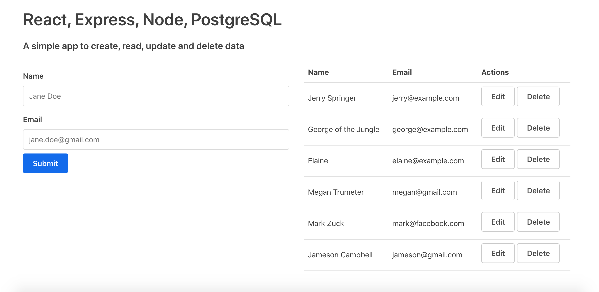

This simple web application showcases the ability to create, read, update, and delete data.

## Built With

* [React](https://reactjs.org/docs/create-a-new-react-app.html) - JavaScript library for building user interfaces
* [Node](https://www.npmjs.com/package/node) - JavaScript runtime built on Chrome's V8 JavaScript engine
* [Express](https://expressjs.com/) - Node.js web application framework
* [PostgreSQL](https://www.postgresql.org/) - a free and open-source relational database management system emphasizing extensibility and SQL compliance.

## Authors

* **Jameson Campbell** - *Initial work* - [Github](https://github.com/JamesonC)

## License

This project is licensed under the MIT License - see the [LICENSE.md](LICENSE.md) file for details